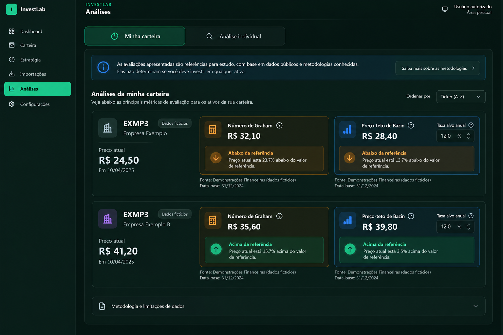
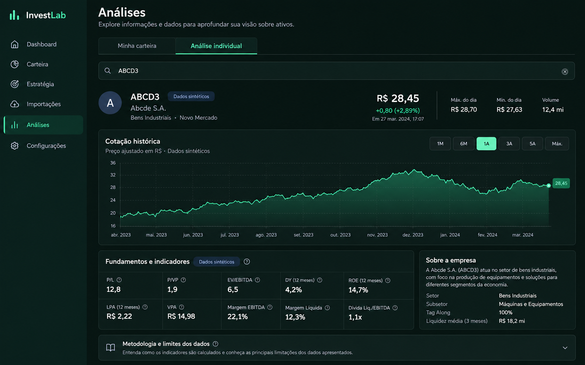

# Análises

## Referência de design

Imagem gerada por IA para orientar hierarquia visual; não é captura do sistema. Tickers, preços e resultados são fictícios. O browser integrado não está disponível nesta sessão, então não houve comparação visual real.

### Referências visuais adotadas

- Diferenciar as duas tarefas atuais: análise da carteira e análise individual.
- Dar destaque ao ativo consultado, ao preço e às duas referências metodológicas disponíveis.
- Manter fonte e data próximas dos valores e limitações em uma área recolhível.
- Apresentar abaixo/acima de uma referência com texto explícito e aparência neutra, sem transformar isso em recomendação.

### Elementos ilustrativos que não representam o comportamento atual

- Tickers, preços, resultados, ordenação, botões de metodologia e conteúdo de ajuda da imagem são fictícios ou podem não existir na interface; não os implementar sem suporte funcional atual.
- Nenhum retorno futuro ou recomendação deve ser inferido dos valores de Graham/Bazin.

### Funcionalidades a preservar

- Análise de oportunidades na carteira com ações classificadas, dados financeiros, cotações e datas de referência.
- Fórmulas, inputs manuais, taxa-alvo já existente, salvamento, estados parciais e fonte/limitações.
- Pesquisa individual, histórico de preços, período selecionado, indicadores, fundamentos e erros/retry.

## Status da entrega

- Referência criada: imagem acima, gerada por IA com dados fictícios; sem badge do Next.js.
- Layout implementado: cada ação analisada agora separa identidade/preço numa coluna lateral e os dois cartões metodológicos na área principal; análise individual mantém seus próprios agrupamentos reais. No mobile, as colunas empilham.
- Validação visual real desktop/mobile: pendente; navegador integrado indisponível nesta sessão.

## Referência adicional — Análise individual

Esta imagem cobre a aba ativa “Análise individual”, ausente na proposta principal. Aplicar a composição de busca, resumo do ativo, histórico, fundamentos e detalhes recolhíveis usando somente os dados e períodos já fornecidos pela aplicação.

O preço e a série são sintéticos. Não implementar máximo/mínimo/volume, retornos, risco ou outros campos que não sejam fornecidos pelo fluxo real. A referência não contém o indicador de desenvolvimento do Next.js.

- Referência criada: imagem acima, desktop, gerada por IA.
- Layout implementado: busca em largura total, resumo da cotação, gráfico histórico amplo e agrupamento de indicadores/leitura anual com contexto dos dados; períodos, fundamentos, loading e erro existentes preservados.
- Validação visual real: pendente; não houve comparação no navegador.
