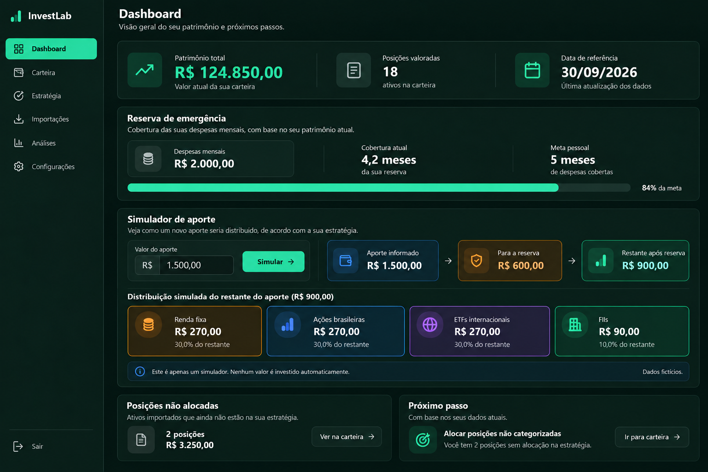

# Dashboard

## Referência de design

Esta é uma referência visual gerada por IA, não uma captura da aplicação. Os valores e a data que aparecem na imagem são fictícios. O navegador integrado estava indisponível durante esta execução; portanto, não há captura real de antes/depois nem validação visual no browser.

### Elementos da imagem que orientam a implementação

- Patrimônio conhecido, quantidade de posições valorizadas e data-base como primeira leitura.
- Reserva e simulador de aporte como tarefas principais, com o fluxo do valor informado para reserva e estratégia.
- Cores de classe iguais às da Estratégia e cores de alerta separadas das classes.
- Atenção e posições sem destino em uma área secundária mais compacta.

### Funcionalidades que devem continuar usando os dados reais do domínio

- O total da carteira soma apenas posições com valor conhecido e informa a completude e as datas-base retornadas pelo serviço.
- A Reserva mostra cobertura de despesas e meta pessoal configurada usando os percentuais e meses retornados pelo domínio. A interface não presume liquidez.
- O simulador mantém o modo de distribuição atual, inclusive compatibilidade com as metas legadas, prioridade da Reserva e limitações de dados. A simulação não movimenta dinheiro.
- O resumo de posições sem destino, alertas, fatos da carteira, explicações e ações condicionais continuam disponíveis.
- Estados de erro, retry, dados parciais, vazio e carregamento mantêm seus contratos atuais.

## Status da entrega

- Referência criada: imagem acima, gerada por IA e identificada como proposta.
- Layout implementado: patrimônio, posições valorizadas e data-base ocupam três regiões de leitura; Reserva apresenta valor, despesas e meta em indicadores; o simulador coloca entrada e processamento ao lado da distribuição em cartões semânticos. Ação seguinte e patrimônio sem destino ficam agrupados abaixo.
- Validação visual real desktop/mobile: pendente, pois o navegador integrado esteve indisponível.
