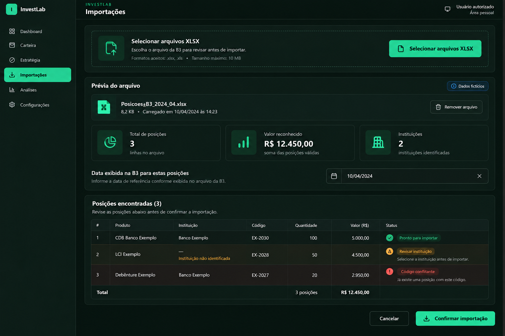

# Importações

## Referência de design

Proposta gerada por IA; não é captura do InvestLab. Dados e arquivo são fictícios. O navegador integrado não esteve disponível nesta sessão, então não foi possível comparar capturas reais.

### Referências visuais adotadas

- Seleção horizontal destacada no topo.
- Prévia do arquivo em toda a largura, com três indicadores visuais com ícones e valores destacados.
- Data exibida na B3 abaixo dos indicadores e tabela ampla em seguida.
- Ações de confirmação agrupadas ao final da revisão.
- Conflitos, dados parciais, loading e erros continuam distintos e acessíveis.

### Elementos ilustrativos que não representam o comportamento atual

- Não adicionar suporte a XLS, limite de tamanho, arrastar/soltar, remoção individual de arquivos ou correção manual de instituição apenas porque aparecem na imagem.
- O estado sem conflito e as linhas sintéticas servem somente para comunicar composição visual.

### Funcionalidades a preservar

- Importação de planilhas XLSX da B3 para posições e movimentações, com prévia antes de confirmar.
- Data de referência digitada manualmente para posições; não inferir pela Data de Emissão.
- Bloqueio em divergência de identidade e indicação de posições sem valor.
- Mensagens de sucesso/erro, estado de processamento e seleção de múltiplos arquivos.

## Status da entrega

- Referência criada: imagem acima, gerada por IA com valores fictícios; sem indicador/badge do Next.js.
- Layout implementado: seletor horizontal no topo; prévia ampla com três indicadores, data de referência, avisos e tabela; confirmação explícita ao fim da revisão. Dados, validações e suporte a múltiplos arquivos preservados.
- Validação visual real desktop/mobile: pendente; navegador integrado indisponível nesta sessão.
