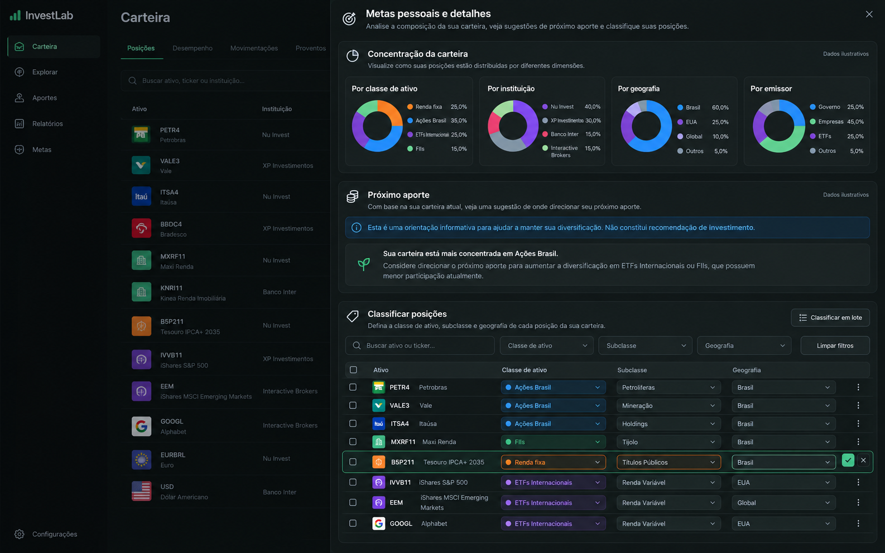

# Carteira — detalhes e classificação

## Referência

Mockup gerado por IA com dados sintéticos para representar o Sheet “Metas pessoais e detalhes”: concentração observada, orientação de aporte e classificação das posições.

## Regras de adaptação

- Preservar somente as dimensões e campos que os dados atuais suportam. A imagem apresenta vários gráficos ao mesmo tempo e rótulos demonstrativos; a interface existente mantém a dimensão selecionada e seus dados canônicos.
- Preservar orientação configurada, estados vazios, classificação por posição/em lote e feedback existentes.
- Não implementar recomendações, pesos ou métricas que apareçam apenas na ilustração.
- A imagem não contém marcador do Next.js.

## Estado

- Referência criada: imagem acima.
- Layout implementado: fluxo vertical do painel existente, mantendo controles de concentração, orientação de aporte e classificação em sequência e sem acrescentar dimensões de dados.
- Validação visual real: pendente; navegador indisponível.
