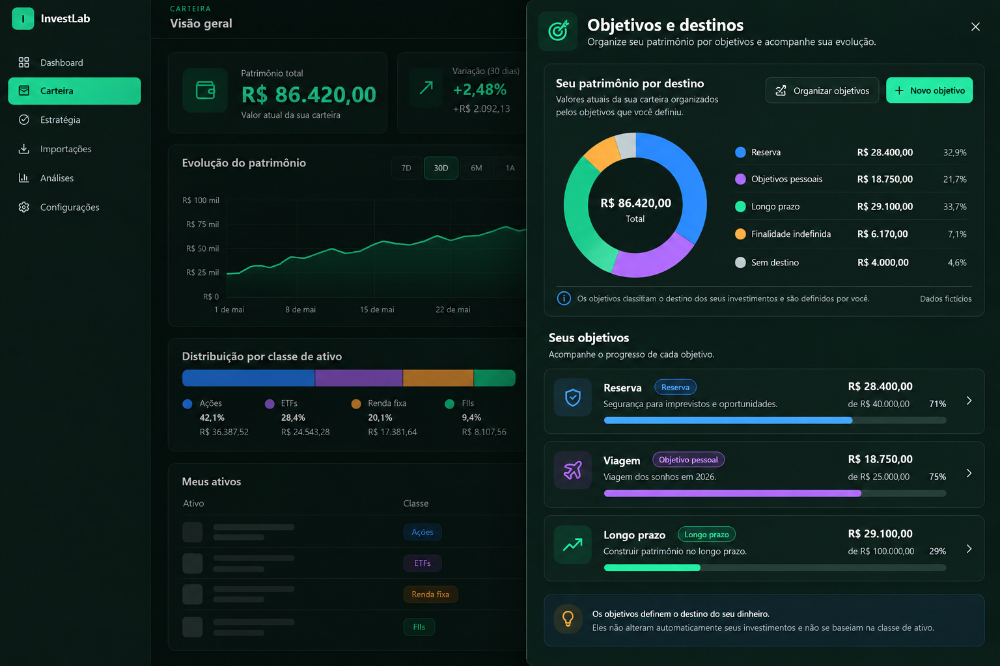
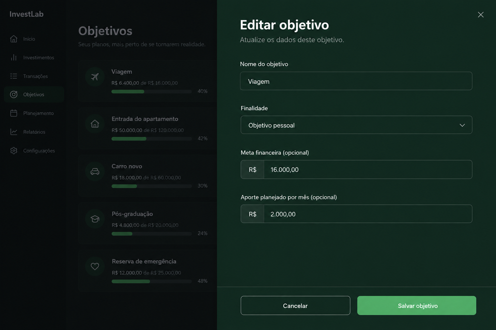
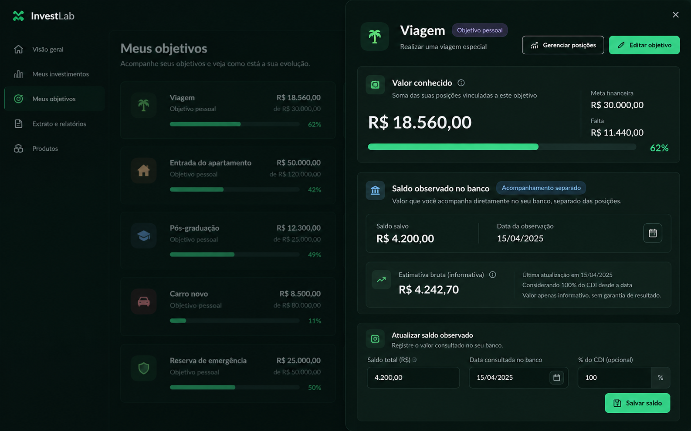
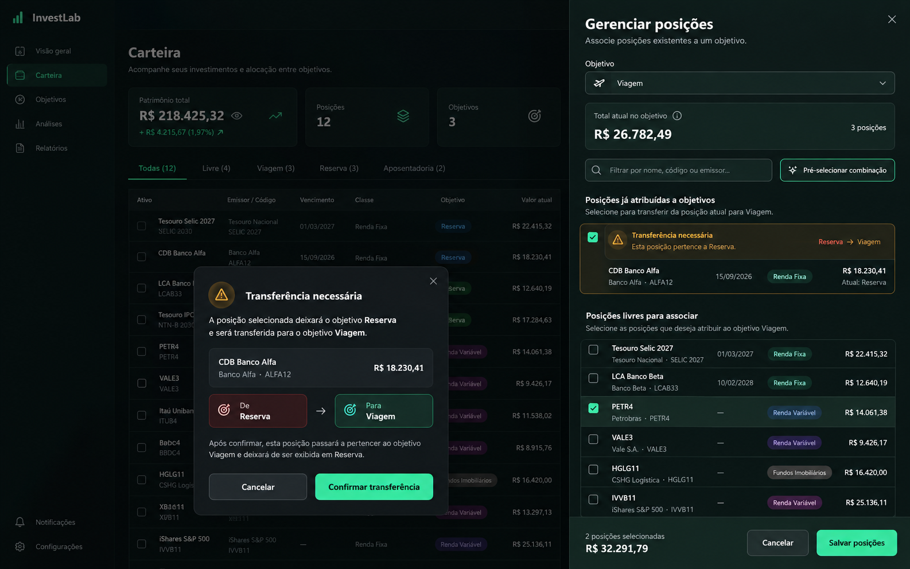
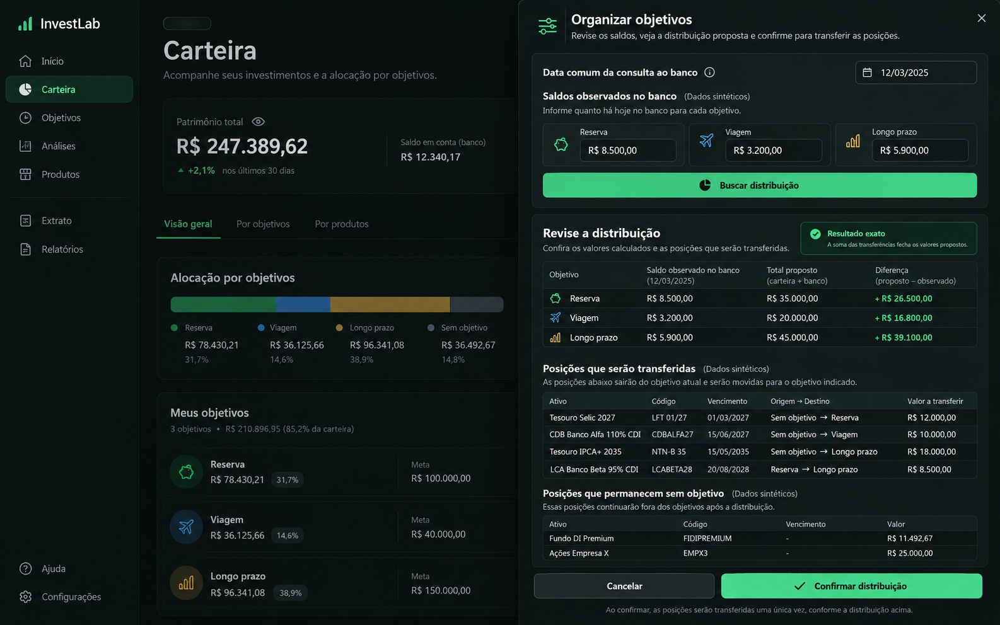
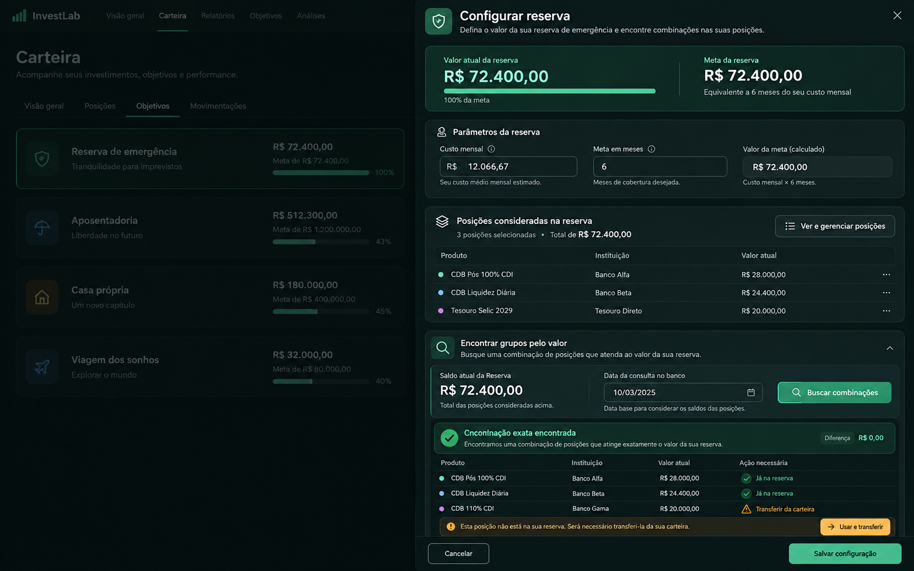

# Carteira e Objetivos

## Referência de design

Imagem de proposta gerada por IA, não é captura da aplicação. Nomes e valores são fictícios. O browser integrado está indisponível nesta sessão, então não há captura real do antes/depois.

### Referências visuais adotadas

- Folha de Objetivos aberta como espaço de trabalho, com título, ações principais e rolagem interna.
- Gráfico de rosca e legenda para comparar valores conhecidos por destino, com as cores de finalidade documentadas.
- Cartões de objetivos com badge de finalidade explícita, valor, meta e progresso existente.
- Distinção visual entre finalidade do destino e classe do ativo; atribuição continua sob controle do usuário.

### Conteúdo da imagem que não será tratado como dado ou funcionalidade

- O fundo mostra linhas de evolução, variação percentual e distribuição por classe como composição ilustrativa da IA. Esses números e gráficos não serão adicionados sem fonte real já disponível na página.
- O gráfico de destino usa valores fictícios apenas para mostrar hierarquia, legenda e semântica.

### Funcionalidades a preservar

- Visão geral, posições, movimentações e acesso à folha de Objetivos.
- Atribuições exclusivas, organização conjunta e confirmação explícita de transferências.
- Metas, finalidade, valores conhecidos, acompanhamento de saldo bancário datado e seus avisos de limitação.
- Importação, classificação, exclusão segura de objetivos e estados de erro, vazio e carregamento.

## Status da entrega

- Referência criada: imagem acima, gerada por IA e identificada como proposta.
- Layout implementado: a Carteira mantém os resumos e gráficos reais existentes; a folha de Objetivos tem largura lateral mais próxima da referência, com ações no cabeçalho do patrimônio por destino, rosca e legenda em painel amplo e lista de objetivos em linhas verticais abaixo. Dados, metas e controles continuam disponíveis.
- Validação visual real desktop/mobile: pendente; navegador integrado indisponível nesta sessão.

## Referências dos subfluxos ativos

### Criar ou editar objetivo

Referência sintética para os campos de nome, finalidade, meta e aporte planejado, com ações no rodapé da folha. Os dados ao fundo são fictícios; não adicionar campos ou regras ausentes do formulário real.

- Referência criada: imagem gerada por IA, sem indicador do Next.js.
- Layout implementado: campos em sequência vertical, agrupados em painel amplo, com ações visíveis no rodapé durante a rolagem; validações, valores, finalidade e persistência continuam os mesmos.
- Validação visual real: pendente; navegador indisponível.

### Detalhe e saldo observado

Orientar a hierarquia do valor calculado/meta/progresso e do acompanhamento bancário separado, com data observada, projeção disponível e formulário de atualização. O mockup é sintético; exibir projeção somente quando já houver dados confiáveis e manter as limitações reais.

### Gerenciar posições

Referência para a seleção de posições inteiras, identificação do destino atual e confirmação explícita de transferência. Os registros e o diálogo ao fundo são ilustrativos; não alteram a exclusividade nem os critérios da API.

### Organizar objetivos

Referência para entradas por objetivo, prévia, diferenças, transferências e ação final. Saldos, posições, nomes e valores são dados sintéticos; resultado parcial/exato continua sendo determinado pelo serviço.

### Configurar Reserva

Referência para separar a meta, posições consideradas e busca pelo valor observado. O fluxo real continua usando a seleção, as datas e os retornos existentes; nenhum cálculo ou critério foi alterado.

## Referências complementares da Carteira

- A edição manual na visão Posições está em [`../portfolio-positions/manual-position-reference.png`](../portfolio-positions/manual-position-reference.png).
- O Sheet “Metas pessoais e detalhes” está em [`../portfolio-allocation/allocation-details-reference.png`](../portfolio-allocation/allocation-details-reference.png).

Para todas as imagens desta seção, conteúdos atrás do Sheet e quaisquer estados não descritos como suportados são ilustrativos. As imagens foram geradas por IA, sem marcador do Next.js. Os agrupamentos da tela e largura do painel foram ajustados no código; a comparação visual real em desktop/mobile permanece pendente porque o navegador está indisponível.
