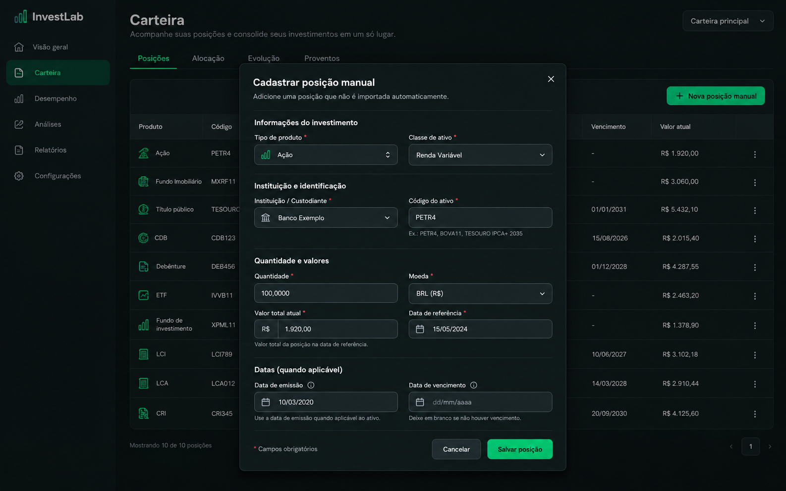

# Carteira — posições e cadastro manual

## Referência

Mockup gerado por IA com registros e valores sintéticos. O diálogo aberto orienta a hierarquia dos campos já existentes e a tabela ao fundo representa a visão `?view=positions`.

## Regras de adaptação

- Preservar `PortfolioTable`, ordenação, colunas, classificações, valores canônicos e edição manual.
- Campos, opções e validações devem continuar determinados por `ManualPositionManager`; não adicionar conta/carteira seletora ou preço de mercado automático ilustrado.
- CDB possui uma configuração de taxa separada e existente; o mockup não especifica mudanças nela.
- Movimentações permanece uma tabela simples coberta pelo padrão compartilhado, sem mockup próprio.
- A imagem não contém marcador do Next.js.

## Estado

- Referência criada: imagem acima.
- Layout implementado: tabela em largura total; diálogo ampliado para o formulário de duas colunas.
- Validação visual real: pendente; navegador indisponível.
