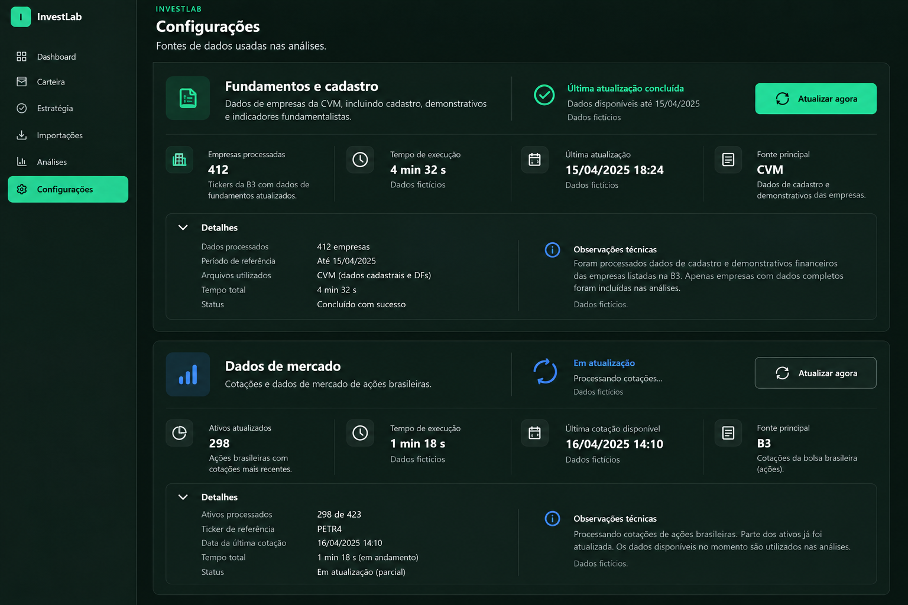

# Configurações

## Referência de design

Imagem gerada por IA, não captura da aplicação. Status, contagens e datas são sintéticos. O browser integrado esteve indisponível, então não houve comparação visual real.

### Referências visuais adotadas

- Separar os dois serviços configuráveis: fundamentos/cadastro e dados de mercado.
- Mostrar primeiro estado e data mais úteis; manter estatísticas técnicas em disclosure.
- Usar rótulo e ícone junto à cor para estados concluídos, parciais, em andamento e falhos.
- Manter as ações de atualização acessíveis e responsivas.

### Elementos ilustrativos que não representam o comportamento atual

- A imagem inventa fontes, números de processados, disponibilidade e botões sempre visíveis. Não alterar o conteúdo da API nem as condições atuais em que ações de sincronização aparecem.
- Textos, datas e duração servem apenas como exemplo fictício.

### Funcionalidades a preservar

- Sincronização de fundamentos e cadastro da CVM, seus status, quantidades e erros.
- Atualização de dados de mercado, data/ticker da cotação e resultados parciais.
- Atualizações manuais, limites, status de processamento, mensagens e detalhes técnicos recolhíveis.

## Status da entrega

- Referência criada: imagem acima, gerada por IA com dados fictícios; sem elemento do Next.js.
- Layout implementado: os painéis independentes da CVM e de dados de mercado ficam empilhados e ocupam a largura disponível, preservando ações, estados e detalhes existentes; o skeleton segue a mesma sequência.
- Validação visual real desktop/mobile: pendente; navegador integrado indisponível nesta sessão.
