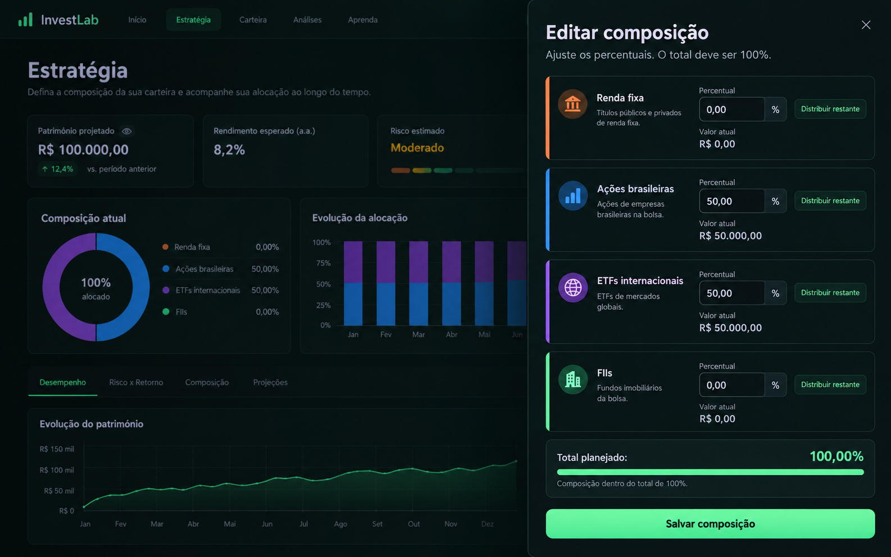

# Estratégia — edição da composição

## Referência

Mockup gerado por IA com percentuais e valores sintéticos para documentar o Sheet aberto de edição, que não aparece na referência principal aprovada.

## Regras de adaptação

- Mostrar somente renda fixa, ações brasileiras, ETFs internacionais e FIIs, com as cores semânticas já aprovadas.
- Percentual zero é permitido; nenhuma classe é obrigatória.
- Preservar “Distribuir restante”, o total calculado e a gravação existente.
- O dashboard ao fundo contém rendimento, risco e histórico fictícios; esses elementos não fazem parte do produto e não devem ser implementados.
- A imagem não contém marcador do Next.js.

## Estado

- Referência criada: imagem acima.
- Layout implementado: Sheet ampliado, classes em cartões empilhados com cores/ícones semânticos, valor atual por classe, campos percentuais mais legíveis, total e ação de salvar destacados. Regras de percentuais e classes zeradas preservadas.
- Validação visual real: pendente; navegador indisponível.
